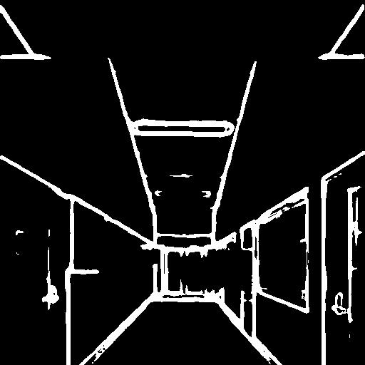
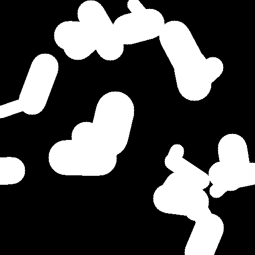
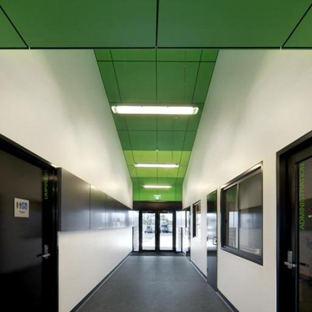
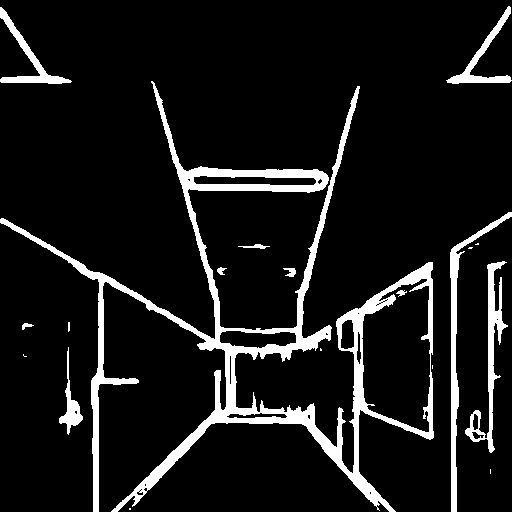
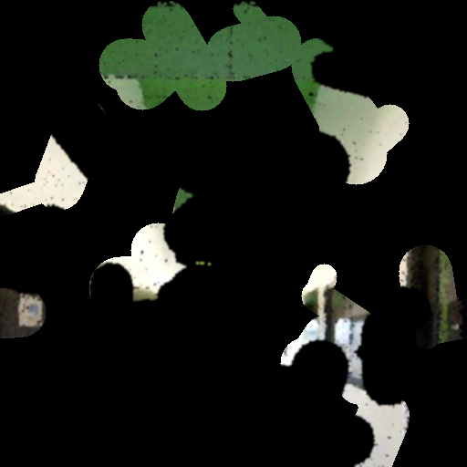
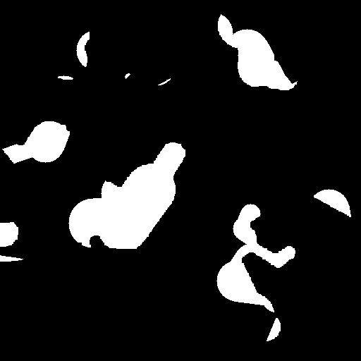
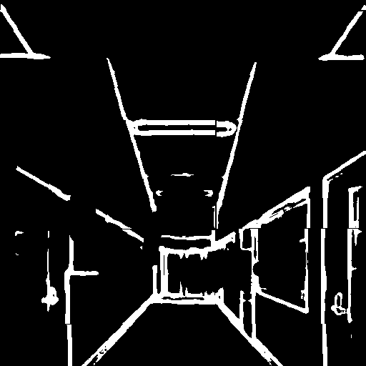
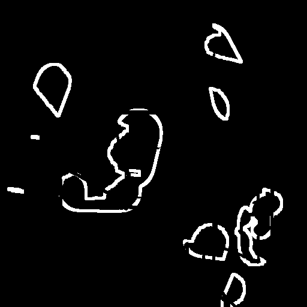

# Generative Multi-view Inpainting for Image-based Rendering of Large Indoor Spaces

## 1) Input data generation
```bash
python input_data_generation.py
```

For example, prepare an example image, guideline and mask.<br/>

</img>
</img>
</img><br/>

Following images will be saved :
cropped ground truth image I_gt, guideline L_gt, color prior I_cp, no color mask M_cp, imperfect guideline ~L and no edge zone N.
<br/>
</img>
</img>
</img>
</img>
</img>
</img><br/>

## 2) Network Architecture


## Citation
