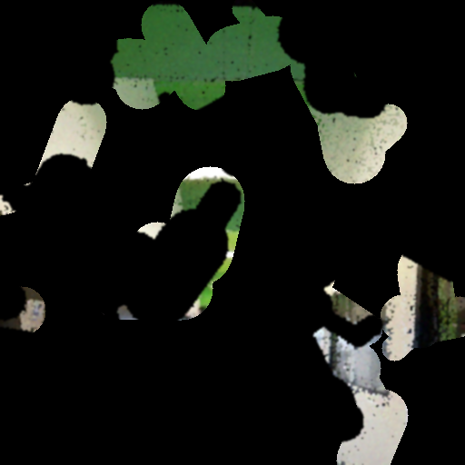

# Generative MVI

This repository will provide codes including network architecture, input data generation and Anti-specificity Loss proposed in our paper.

## 1) Network Architecture
</img>
The generator and discriminator of proposing network will be provided in the python file 'model.py'.

## 2) Training input data generation
Example image, guideline and mask are prepared in the 'data' directory.<br/>
</img>
</img>
</img><br/>

You will be able to run the code to generate sample training input data.
```bash
python input_data_generation.py
```
Following images will be saved :
cropped ground truth image I_gt, guideline L_gt, color prior I_cp, no color mask M_cp, imperfect guideline ~L and no edge zone N.
<br/>
</img>
</img><br/>
</img>
</img>
</img>
</img><br/>


## 3) Anti-specificity Loss
</img><br/>
The source code for the anti-specificity loss will be also available.
