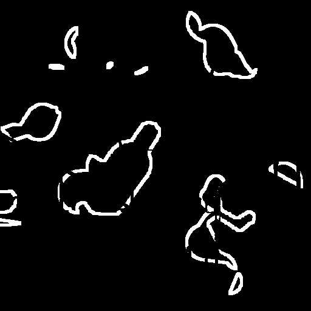

# Generative multiview inpainting for object removal in large indoor spaces

This repository provides codes including network architecture, input data generation and Anti-specificity Loss proposed in our [paper](https://journals.sagepub.com/doi/10.1177/1729881421996544).

## 1) Network Architecture
</img>
The generator and discriminator of proposing network will be provided in the python file 'model.py'.

## 2) Training input data generation
Example image, guideline and mask are prepared in the 'data' directory.<br/>
The image is a sample test image from Places2 dataset ([Progressive Growing of GANs for Improved Quality, Stability, and Variation](https://arxiv.org/abs/1710.10196)). <br/>
</img>
</img>
</img><br/>

You will be able to run the code to generate sample training input data.
```bash
python input_data_generation.py
```
Following images will be saved :
cropped ground truth image I_gt, guideline L_gt, color prior I_cp, no color mask M_cp, imperfect guideline ~L and no edge zone N.
<br/>
</img>
</img><br/>
</img>
</img>
</img>
</img><br/>


## 3) Anti-specificity Loss
</img><br/>
The source code for the anti-specificity loss will be also available in 'Loss.py'.


## Citation

Please consider citing the corresponding publication if you use this work in an academic context:
```
@article{kim2021generative,
  title={Generative multiview inpainting for object removal in large indoor spaces},
  author={Kim, Joohyung and Hyeon, Janghun and Doh, Nakju},
  journal={International Journal of Advanced Robotic Systems},
  volume={18},
  number={2},
  year={2021},
  publisher={SAGE Publications Sage UK: London, England}
}
